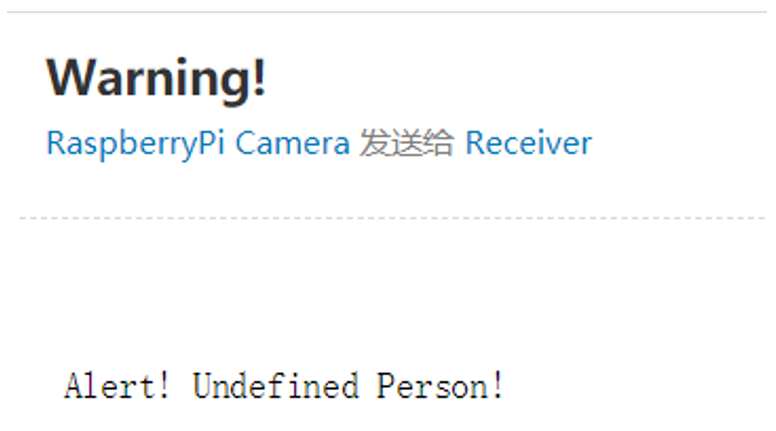

# Realtime Monitor

📹A Raspberry Pi based embedded system project

This real time monitor is based on Raspberry Pi 3. The camera module generates the video stream and raspberry pi analyzes the video streaming with OpenCV library. A pretrained model is used to do the facial recognition. The real-time video can be streamed to a website for remote monitoring. When there is an intruder detected, email alarm system will send a alarm to the owner

## Facial Recognition

Face recognition: OpenCV library and Haar Cascade classifier

The model will tag each face with a likelihood percentage associated with predefined labels. If the percentage is higher than threshold, the corresponding predefined label will be assigned to the current face. If the percentage is lower than threshold, the current face will be tagged unknown

## Remote Monitoring

Video data streaming and remote monitoring: Flask framework

## Email Alarm

When there is an intruder, meaning the assigned tag is unknown, the email alarm system will send the owner a warning email

## License

MIT License